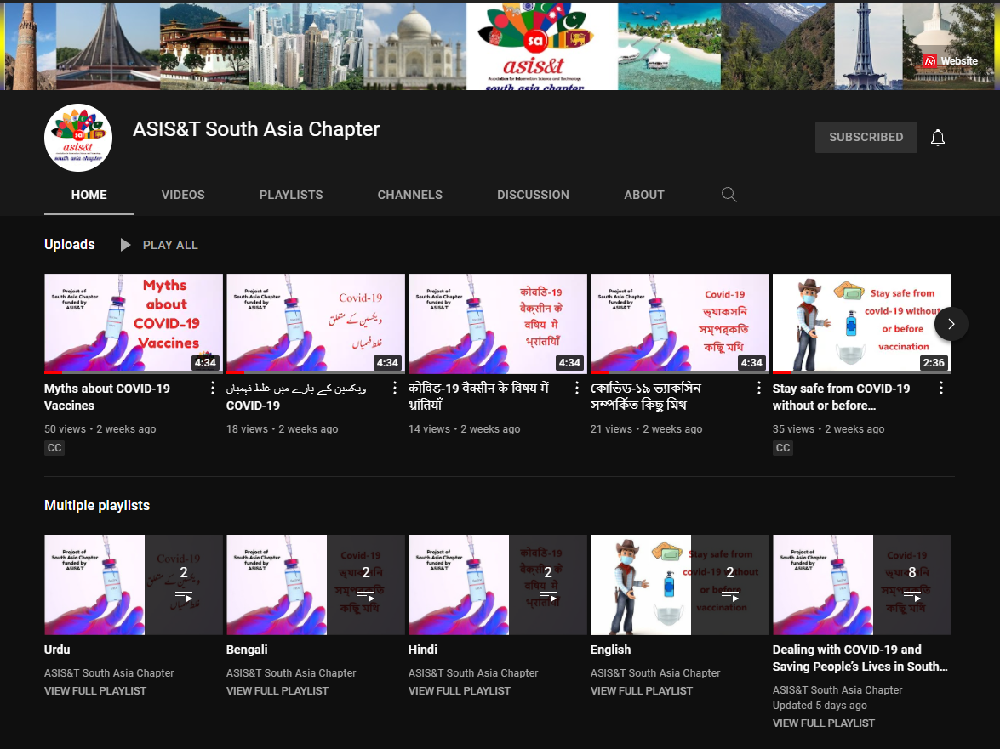

## About the Project
The South Asia Chapter (ASIS&T) has been granted the [ASIS&T Special Project Fund](https://www.researchgate.net/deref/https%3A%2F%2Fwww.asist.org%2F2021%2F06%2F17%2Fchapter-special-project-funds-awarded%2F) of $7000 for the year 2021-22 on the project ‘Dealing with COVID-19 and saving people’s lives in South Asia (SA) areas & beyond - A health informatics promotion project’. The Chapter has set up a [**YouTube channel**](https://www.youtube.com/channel/UC-pt07aaW07tWg7InS2dSDg) to host multilingual videos for disseminating awareness on a variety of topics on COVID-19 in the South Asia region. We have collaborated with the Asia Pacific Chapter and European Chapter to bring their experiences in dealing with similar viruses in the past. Through this channel, we propose to help in fighting misinformation and disinformation regarding COVID-19 information by citing accurate and reliable sources of information.

## Aim & Mission
The goals of this health informatics project are:

1. To spread awareness about COVID-19 issues and behavior.
2. To share the experience of countries with experience of dealing with similar viruses.
3. To help inform people by identifying pertinent topics to deal with COVID-19 highlighting the importance of reliable and accurate information.
4. To identify and share accurate and reliable information from authoritative information sources to fight misinformation and disinformation regarding COVID-19 information.

Through these videos, the Chapter will be able to reach out to the masses in the South Asia region highly impacted by COVID-19. The videos will help in spreading awareness about critical COVID-19 care precautions. The topics of the videos will provide accurate & reliable information thereby helping to fight misinformation and disinformation regarding COVID-19. These videos will act as a bridge connecting information with practice- a core principle of ASIS&T.

A total of 10 videos on a wide range of topics related to COVID-19 such as ‘Myths about COVID-19 vaccines’; ‘Stay safe from COVID1-9 without or before vaccination’; ‘Vaccine Facts: All you need to know about them’; ‘Myths about COVID-19’ will be added. These multilingual videos are available in five languages- Bangla, English, Hindi, Urdu, and Sinhala. We further collaborate with the creator of ‘Buddysuaurs’ to incorporate videos on the topic ‘Things to do in self-isolation’.

To capture the experiences of children during COVID-19 the project will organize a [**series of workshops**](https://www.asist.org/2021/10/15/international-digital-story-writing-competition/) that will culminate in creative writing and drawing competitions in the South Asia region for primary and secondary school children.

## Project Team
The project team has members from five countries representing both the Asia Pacific and South Asia regions:

 - Bhakti Gala, PhD, Chair, ASIS&T South Asia, Central University of Gujarat, India
- Sam Chu, PhD, ASIS&T Chapter Assembly Director, University of Hong Kong, Hong Kong
 - Md. Anwarul Islam, PhD, Past Chair, ASIS&T South Asia Chapter, Dhaka University, Bangladesh
- Syeda Hina Batool, PhD, Social Media Manager, ASIS&T South Asia Chapter, University of the Punjab, Pakistan
- Helen Chan, ASIS&T Asia Pacific Chapter, University of Hong Kong, Hong Kong
- Raj Kumar Bhardwaj, PhD, Member, ASIS&T South Asia Chapter, Central University of Punjab, India
- Manika Lamba, Newsletter Officer & Webmaster, ASIS&T South Asia Chapter, University of Delhi, India
- Prasadi Kanchana Jayasekara, Member, ASIS&T South Asia Chapter, University of Ruhuna, Sri Lanka

We acknowledge the participation of Crystal Fulton, ASIS&T European Chapter, and Jiban K Pal, Member, ASIS&T South Asia Chapter during our initial discussions.

### Different Tasks Performed

1. Video transcripts were prepared by the following ASIS&T members in English:
- Video 1: Hina Batool, Manika Lamba, and Prasadi Kanchana Jayasekara
- Video 2: Sam Chu, Athena WL Hong, Helen Chen, and Xiangning Li
- Video 3: Bhakti Gala, and Raj Kumar Bhardwaj
- Video 4: Md. Anwarul Islam and Bhakti Gala
- Video 5: YC Chan and Sam Chu

2. The transcripts were translated into four different South Asian languages by the following ASIS&T members:
- Hindi: Bhakti Gala, Raj Bhardwaj
- Bengali: Md Anwarul Islam
- Urdu: Hina Batool
- Sinhala: Prasadi Kanchana Jayasekara

3. Digital Story Competition was organized by Sam Chu and Helen Chen

4. Marketing was done by Manika Lamba

## Media Coverage

The Project has been featured in
- [Newsletter of the University Librarians Association of Sri Lanka](newsletter.pdf)
- [Advanced Information Network of Libraries in Gujarat (ADINET) Newsletter](adinet.pdf)
- [Information Matters](https://informationmatters.org/2021/10/saving-lives-a-health-informatics-project-on-covid-19-from-asist-south-asia-chapter/),

- [ASIS&T South Asia Chapter News](https://www.asist.org/chapters-saasist-news/)

- [ASIS&T South Asia Chapter Blog](https://www.asist.org/chapters-saasist-blog/)

- [The Librarian Times Blog](http://www.thelibrariantimes.com/uncategorized/south-asia-chapter-asist-has-been-awarded-special-funding-to-pursue-a-project-on-dealing-with-covid-19/)

# Videos

### Video 1: Myths about COVID-19 Vaccines

**“Myths about COVID-19 Vaccines”** is the first video of the project. This video clarifies various myths surrounding COVID-19 Vaccines related to their development, long-term effects, infertility, and social distancing, among others.

The video can be viewed in
- English

<iframe width="560" height="315" src="https://www.youtube.com/embed/FTdccU5VZMM" title="YouTube video player" frameborder="0" allow="accelerometer; autoplay; clipboard-write; encrypted-media; gyroscope; picture-in-picture" allowfullscreen></iframe>

- Hindi

<iframe width="560" height="315" src="https://www.youtube.com/embed/gDJemud7MaY" title="YouTube video player" frameborder="0" allow="accelerometer; autoplay; clipboard-write; encrypted-media; gyroscope; picture-in-picture" allowfullscreen></iframe>

- Bengali

<iframe width="560" height="315" src="https://www.youtube.com/embed/HEcVciX2ZRs" title="YouTube video player" frameborder="0" allow="accelerometer; autoplay; clipboard-write; encrypted-media; gyroscope; picture-in-picture" allowfullscreen></iframe>

- Urdu

<iframe width="560" height="315" src="https://www.youtube.com/embed/qSI3RC1Kilo" title="YouTube video player" frameborder="0" allow="accelerometer; autoplay; clipboard-write; encrypted-media; gyroscope; picture-in-picture" allowfullscreen></iframe>

- Sinhala

<iframe width="560" height="315" src="https://www.youtube.com/embed/LH_8YBQclpE" title="YouTube video player" frameborder="0" allow="accelerometer; autoplay; clipboard-write; encrypted-media; gyroscope; picture-in-picture" allowfullscreen></iframe>

### Video 2: Stay safe from COVID-19 without or before vaccination
**“Stay safe from COVID-19 without or before vaccination”** is the second video of the project. This video has been prepared to give guidelines for staying safe from COVID-19 without or before vaccination. This video is produced as a collaboration with the ASIS&T Asia Pacific Chapter.

The video can be viewed in

- English

<iframe width="560" height="315" src="https://www.youtube.com/embed/pTulrrHjh_0" title="YouTube video player" frameborder="0" allow="accelerometer; autoplay; clipboard-write; encrypted-media; gyroscope; picture-in-picture" allowfullscreen></iframe>

- Hindi

<iframe width="560" height="315" src="https://www.youtube.com/embed/rdLVNIYQbMY" title="YouTube video player" frameborder="0" allow="accelerometer; autoplay; clipboard-write; encrypted-media; gyroscope; picture-in-picture" allowfullscreen></iframe>

- Bengali

<iframe width="560" height="315" src="https://www.youtube.com/embed/bm8r1TVOV4I" title="YouTube video player" frameborder="0" allow="accelerometer; autoplay; clipboard-write; encrypted-media; gyroscope; picture-in-picture" allowfullscreen></iframe>

- Urdu

<iframe width="560" height="315" src="https://www.youtube.com/embed/o__u6h_qvMo" title="YouTube video player" frameborder="0" allow="accelerometer; autoplay; clipboard-write; encrypted-media; gyroscope; picture-in-picture" allowfullscreen></iframe>

- Sinhala

<iframe width="560" height="315" src="https://www.youtube.com/embed/QxjWhptAgMc" title="YouTube video player" frameborder="0" allow="accelerometer; autoplay; clipboard-write; encrypted-media; gyroscope; picture-in-picture" allowfullscreen></iframe>

### Video 3: Vaccine facts - All you need to know about them

**“Vaccine facts: All you need to know about them”** is the third video of the project. This video describes some basic facts about vaccines. It describes the key components of vaccines and types of vaccines. The video further answers some basic questions like what are the common side effects after getting vaccinated? Which precautions should be taken after vaccination?

The video can be viewed in

- English

<iframe width="560" height="315" src="https://www.youtube.com/embed/zP95SDbHuZg" title="YouTube video player" frameborder="0" allow="accelerometer; autoplay; clipboard-write; encrypted-media; gyroscope; picture-in-picture" allowfullscreen></iframe>

- Hindi

<iframe width="560" height="315" src="https://www.youtube.com/embed/F-PiIK49_XE" title="YouTube video player" frameborder="0" allow="accelerometer; autoplay; clipboard-write; encrypted-media; gyroscope; picture-in-picture" allowfullscreen></iframe>

- Bengali

<iframe width="560" height="315" src="https://www.youtube.com/embed/875eKECZ4rM" title="YouTube video player" frameborder="0" allow="accelerometer; autoplay; clipboard-write; encrypted-media; gyroscope; picture-in-picture" allowfullscreen></iframe>

- Urdu

<iframe width="560" height="315" src="https://www.youtube.com/embed/mcy1mFXeKkE" title="YouTube video player" frameborder="0" allow="accelerometer; autoplay; clipboard-write; encrypted-media; gyroscope; picture-in-picture" allowfullscreen></iframe>

- Sinhala

<iframe width="560" height="315" src="https://www.youtube.com/embed/Ei_o1odWUbk" title="YouTube video player" frameborder="0" allow="accelerometer; autoplay; clipboard-write; encrypted-media; gyroscope; picture-in-picture" allowfullscreen></iframe>

### Video 4: Myths about COVID-19

**"Myths about COVID-19"** is the fourth video of the project. The video identifies some common myths among people regarding COVID-19 like COVID-19 spreads by swimming; drinking methanol, ethanol or bleach prevents or cures COVID-19, and many more.

The video can be viewed in

- English

<iframe width="560" height="315" src="https://www.youtube.com/embed/kV-LTokj23Q" title="YouTube video player" frameborder="0" allow="accelerometer; autoplay; clipboard-write; encrypted-media; gyroscope; picture-in-picture" allowfullscreen></iframe>

- Hindi

<iframe width="560" height="315" src="https://www.youtube.com/embed/saBRMdV2NgM" title="YouTube video player" frameborder="0" allow="accelerometer; autoplay; clipboard-write; encrypted-media; gyroscope; picture-in-picture" allowfullscreen></iframe>

- Bengali

<iframe width="560" height="315" src="https://www.youtube.com/embed/7CrjDiEraWs" title="YouTube video player" frameborder="0" allow="accelerometer; autoplay; clipboard-write; encrypted-media; gyroscope; picture-in-picture" allowfullscreen></iframe>

- Urdu

<iframe width="560" height="315" src="https://www.youtube.com/embed/UVtw2rjgPtE" title="YouTube video player" frameborder="0" allow="accelerometer; autoplay; clipboard-write; encrypted-media; gyroscope; picture-in-picture" allowfullscreen></iframe>

- Sinhala
<iframe width="560" height="315" src="https://www.youtube.com/embed/IV8qaK_buCk" title="YouTube video player" frameborder="0" allow="accelerometer; autoplay; clipboard-write; encrypted-media; gyroscope; picture-in-picture" allowfullscreen></iframe>

### Video 5: Things to do during the pandemic

**"Things to do during the pandemic"** is the fifth video of the project. This video shares different things to do during self-isolation or while going through lockdowns. The dinosaur buddies- Long Neck, Spikey, and Bigmouth from the series [**Buddysaurus**](http://www.buddysaurus.com) created by YC Chan take us on a delightful journey. The buddies introduce various activities which may be undertaken to help deal with loneliness. To seek help we have shared helpline numbers from Bangladesh, India, Pakistan, and Sri Lanka. The video is prepared in collaboration with ASIS&T Asia Pacific Chapter.

The video can be viewed in

- English
<iframe width="560" height="315" src="https://www.youtube.com/embed/3OTEGGte9is" title="YouTube video player" frameborder="0" allow="accelerometer; autoplay; clipboard-write; encrypted-media; gyroscope; picture-in-picture" allowfullscreen></iframe>

- Hindi

COMING SOON

- Bengali
<iframe width="560" height="315" src="https://www.youtube.com/embed/dIHnQ0_3q5s" title="YouTube video player" frameborder="0" allow="accelerometer; autoplay; clipboard-write; encrypted-media; gyroscope; picture-in-picture" allowfullscreen></iframe>

- Urdu
<iframe width="560" height="315" src="https://www.youtube.com/embed/dcfyGGhWgYM" title="YouTube video player" frameborder="0" allow="accelerometer; autoplay; clipboard-write; encrypted-media; gyroscope; picture-in-picture" allowfullscreen></iframe>

- Sinhala

COMING SOON

