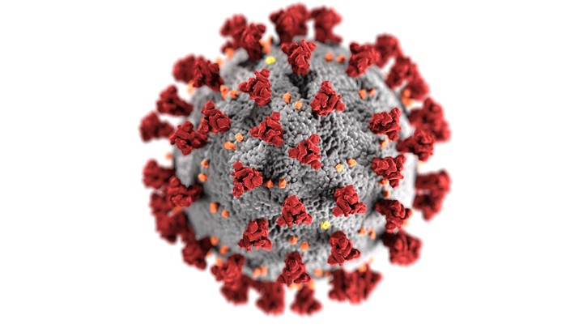

This is a pilot project which was analysed and executed in April 2021 to presents the research productivity of AIIMS, New Delhi on **covid-19/coronavirus** literature using R programming language. The data was retrieved from Web of Science, Scopus, and PubMed databases for the Query = “corona” OR “covid-19” OR “coronavirus” for AIIMS, New Delhi. Metadata for 853 studies were identified from all the three databases which were then merged and removed for duplicates. Additionally, the document type: comment, letter, correction, editorial, editorial material, editorial material-early access, erratum, published erratum, meeting abstract, note, and retracted, were also removed.

The **storyboard** visualizes the results of *descriptive analysis, network analysis, and topic modeling*.

The **dashboard** shows the *topic modeling* results.
