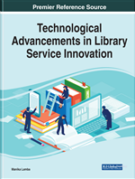

## Description
Innovations in library services are rapidly developing within numerous areas including building design, program and event planning, patron experience and engagement, literacy program development, and administration and management. To ensure these changes are implemented and considered successfully, a closer look at the challenges, trends, and practices of these innovations is crucial.

Technological Advancements in Library Service Innovation examines the recent activities of successful and groundbreaking research and practices around the world surrounding library service innovation and presents various forward-thinking initiatives. It also provides an overview of libraries’ successful experiences, identifies emerging global themes and trends, and offers guidance to library practitioners on how to pursue the recent trends in their own library environment. Covering topics such as technology adoption and organizational structures, this book is ideal for library professionals, researchers, academicians, instructors, and students.

## Coverage
The many academic areas covered in this publication include, but are not limited to:

- Administration
- Building Design
- Conceptual Models
- Creative Programming
- Digital Tools
- Disruptive Innovation
- Information Retrieval
- Knowledge Management
- Organizational Structures
- Technology Adoption

## Citation
#### MLA
Lamba, Manika, editor. Technological Advancements in Library Service Innovation. IGI Global, 2022. http://doi:10.4018/978-1-7998-8942-7
#### APA
Lamba, M. (Ed.). (2022). Technological Advancements in Library Service Innovation. IGI Global. http://doi:10.4018/978-1-7998-8942-7
#### Chicago
Lamba, Manika, ed. Technological Advancements in Library Service Innovation. Hershey, PA: IGI Global, 2022. http://doi:10.4018/978-1-7998-8942-7
